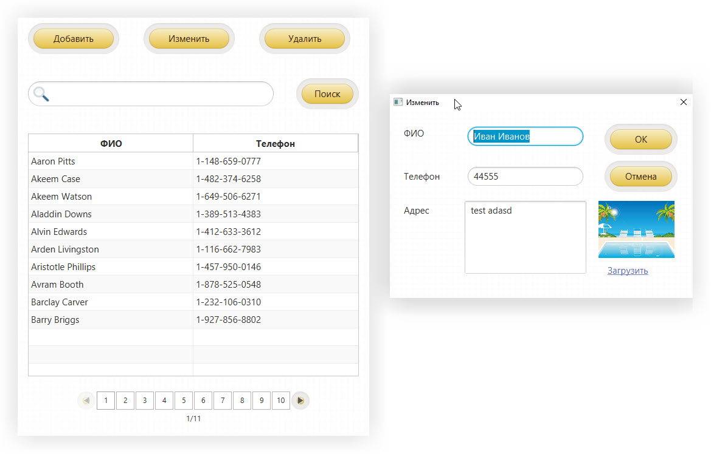
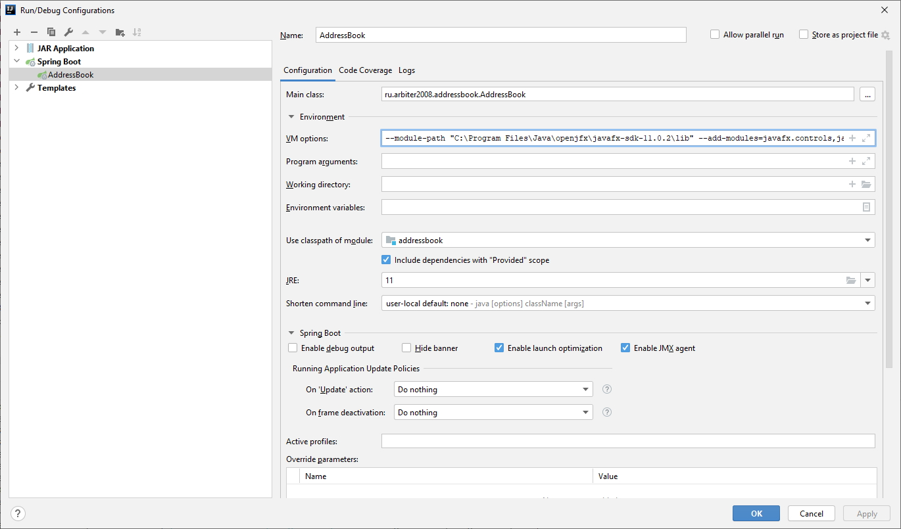

# ADDRESSBOOK-JAVAFX-SPRINGBOOT
Проект "Адресная книга на JavaFX + SpringBoot". Комплексный проект: работа с изображениями в БД, постраничный вывод, стилизация дизайна .

- Загрузка и сохранение изображений в БД
- Постраничный вывод данных
- CRUD операции и поиск
- Использование SpringBoot в десктоп приложении
- Применение Spring Data JPA для доступа к БД
- Применение CSS для стилизации приложения

Версии ПО:
- Liberica JDK 11.0.9.1
- JavaFX SDK 11.0.2
- Spring Boot/Spring Data JPA 2.4.1
- ControlsFX 11.0.2
- sqlite-jdbc:3.32.3.3
- javafx-maven-plugin:0.0.5
- lombok:1.18.16
- IntelliJ IDEA Ultimate 2020.3 / Spring Tool Suite 4 4.9.0.RELEASE
- Maven 3.6.3

Как запускать проект:

1. скачиваете JavaFX SDK (если до этого не скачивали): https://gluonhq.com/products/javafx/
2. открываете проект в IDE (можете скачать архив или клонировать)
3. нажимаете обновить во вкладке Maven - чтобы подкачалось все, что нужно.
- Через Run Configurations:
    - если автоматически не было создано - то в настройках запуска проекта создаете тип Spring Boot,
      указываете Main-класс (AddressBook) и прописываете доп. параметры:
      --module-path "ВАШ ПУТЬ ДО ПАПКИ JAVAFX/lib" 
      --add-modules=javafx.fxml,javafx.controls,javafx.swing,javafx.graphics 
      --add-exports=javafx.graphics/com.sun.javafx.application=ALL-UNNAMED
    - Параметр --add-exports открывает доступ к модулям пакетов JavaFX из любых ваших классов 
      (иначе выйдет ошибка доступа "cannot export module for class")
- Через javafx-maven-plugin:
    - подключаете необходимые JavaFX-зависимости в pom-файле
    - подключаете javafx-maven-plugin
    - javafx:run

JavaFX SceneBuilder (для визуального редактирования файлов FXML) - можно скачать отсюда: https://gluonhq.com/products/scene-builder/
